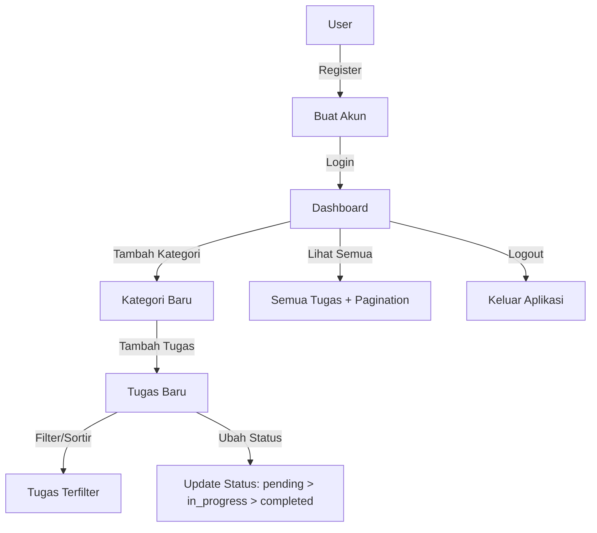

# 📝 TodoMaster - Aplikasi Manajemen Tugas Modern

TodoMaster adalah aplikasi manajemen tugas yang komprehensif dengan fitur kategori, pelacakan status, dan dashboard intuitif. Aplikasi ini dibangun dengan Laravel untuk backend dan React untuk frontend, menawarkan pengalaman pengguna yang lancar dan aman.

## ✨ Fitur Utama

- **🔐 Autentikasi Pengguna yang Aman**
  - Registrasi dengan nama, email, dan password
  - Login dengan email dan password
  - Autentikasi token dengan Laravel Sanctum
  - Refresh token untuk sesi yang lebih aman

- **📋 Manajemen Kategori**
  - Buat kategori kustom (General, Urgent, Important, dll)
  - Organisasi tugas dengan kategori yang bermakna
  - Validasi kategori unik per pengguna

- **✅ Pengelolaan Tugas Lengkap**
  - Buat tugas dengan judul, deskripsi, tenggat waktu, dan kategori
  - Lacak status tugas (Tertunda → Dalam Proses → Selesai)
  - Filter tugas berdasarkan judul, status, dan kategori
  - Soft delete untuk penghapusan yang aman

- **📊 Dashboard Intuitif**
  - Tampilan tugas terbaru untuk akses cepat
  - Lihat tugas yang sedang dalam proses
  - Gambaran visual status tugas Anda

## 🔄 Alur Aplikasi



## 🗄️ Struktur Database

### 1. Tabel Users
- id
- name
- email (unique)
- email_verified_at (nullable)
- password
- remember_token
- created_at
- updated_at

### 2. Tabel Categories
- id
- user_id (relasi ke Users, constraint onDelete cascade)
- name
- created_at
- updated_at
- unique constraint pada [user_id, name]

### 3. Tabel Todos
- id
- user_id (relasi ke Users, constraint onDelete cascade)
- title
- description (nullable)
- category (string, nullable)
- status (enum: 'pending', 'in_progress', 'completed', default 'pending')
- due_date (nullable)
- created_at
- updated_at
- deleted_at (soft delete)

### 4. Tabel Sessions
- id (string, primary)
- user_id (nullable, relasi ke Users, constraint onDelete cascade)
- payload (text)
- last_activity (integer, index)
- created_at
- updated_at

### 5. Tabel Personal Access Tokens
- id
- tokenable_id
- tokenable_type
- name
- token (string, unique)
- abilities (text, nullable)
- last_used_at (nullable)
- expires_at (nullable)
- created_at
- updated_at

## 🚀 Cara Penggunaan

### Registrasi & Login
1. Registrasi dengan nama, email, dan password
2. Login menggunakan email dan password
3. Aplikasi menggunakan Laravel Sanctum untuk autentikasi berbasis token

### Mengelola Kategori
1. Buat kategori baru (General, Urgent, Important)
2. Pilih kategori saat membuat tugas baru
3. Setiap pengguna memiliki kategori unik (kombinasi user_id dan nama kategori bersifat unik)

### Mengelola Tugas
1. Buat tugas baru dengan judul, deskripsi, tenggat waktu, dan kategori
2. Lihat dan filter tugas berdasarkan judul, status, atau kategori
3. Perbarui status tugas ('pending' → 'in_progress' → 'completed')
4. Tugas menggunakan soft delete untuk penghapusan yang aman

### Dashboard & Visualisasi
1. Lihat 6 tugas terbaru di dashboard
2. Pantau tugas yang sedang dalam proses
3. Gunakan "View All" untuk melihat semua tugas dengan pagination

## 💻 Teknologi

### Backend
- Framework: Laravel 10+
- Database: MySQL/PostgreSQL
- Autentikasi: Laravel Sanctum
- Soft Deletes
- API RESTful

### Frontend
- React.js dengan TypeScript
- Tailwind CSS
- State Management: Redux/Context API
- Axios untuk API requests

## 📱 Tampilan Aplikasi

### Dashboard


### Halaman Tugas


### Form Tambah Tugas


## 🛠️ Instalasi & Pengembangan

### Prasyarat
- PHP = 8.2
- Composer
- Node.js >= 14
- NPM/Yarn
- Database PostgreSQL

### Langkah Instalasi Backend
```bash
# Clone repositori
git clone https://github.com/defaaryawar/Todo-app-list.git

# Masuk ke direktori backend
cd cd todo-app-list/laravel-todo-api

# Instal dependensi
composer install

# Salin file .env
cp .env.example .env

# Konfigurasi database di file .env

# Generate application key
php artisan key:generate

# Jalankan migrasi
php artisan migrate

# Konfigurasikan Sanctum (opsional)
php artisan vendor:publish --provider="Laravel\Sanctum\SanctumServiceProvider"

# Jalankan server
php artisan serve
```

### Langkah Instalasi Frontend
```bash
# Masuk ke direktori frontend
cd todo-app-list/clients-todo

# Instal dependensi
npm install

# Jalankan server pengembangan
npm run dev
```

## 📋 API Endpoints

### Autentikasi
- `POST /api/auth/register` - Registrasi pengguna baru
- `POST /api/auth/login` - Login pengguna
- `POST /api/auth/refresh` - Refresh token
- `POST /api/auth/logout` - Logout pengguna (protected)
- `GET /api/auth/user` - Mendapatkan data pengguna yang sedang login (protected)
- `GET /api/sanctum/csrf-cookie` - Mendapatkan CSRF cookie untuk autentikasi Sanctum

### Kategori (Protected Routes)
- `GET /api/categories` - Mendapatkan semua kategori pengguna
- `POST /api/categories` - Membuat kategori baru
- `DELETE /api/categories/{name}` - Menghapus kategori berdasarkan nama

### Tugas (Protected Routes)
- `GET /api/todos` - Mendapatkan semua tugas
- `POST /api/todos` - Membuat tugas baru
- `GET /api/todos/{id}` - Mendapatkan detail tugas tertentu
- `PUT/PATCH /api/todos/{id}` - Memperbarui tugas
- `DELETE /api/todos/{id}` - Menghapus tugas (soft delete)
